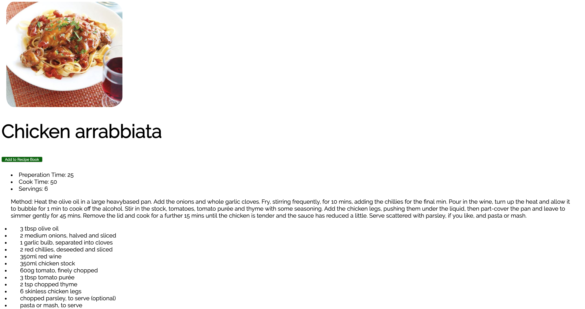

# Chomp

Recipe Finder App

MVP
=

Different options available for generating recipes including a random function.
App will display search results with images and recipe titles.
Clicking on thumbnails will render a page with the full recipe details and links to the original recipe.
Users can save their favourite recipes to their own ‘recipe book’.
User can have more than one recipe book e.g. mains, vegan etc.
User can add their own recipes to their ‘recipe book’.

Extensions
=
A plus button in the thumbnail images will allow a quick add function to add to the recipe book.
Users can add comments to their recipes.

Different options available for generating recipes including a random function. App will display search results with images and recipe titles. Clicking on thumbnails will render a page with the full recipe details and links to the original recipe. Users can save their favourite recipes to their own ‘recipe book’. User can have more than one recipe book e.g. mains, vegan etc. User can add their own recipes to their ‘recipe book’.

Extensions
A plus button in the thumbnail images will allow a quick add function to add to the recipe book. Users can add comments to their recipes.

##Front page

##Recipe Page

##Search by Diet

## Authors

*  [Declan Malone](https://github.com/Dmalone93)
*  [Robin Bailey](https://github.com/RobinBailey84)
*  [Louise Stewart](https://github.com/loustewart)
